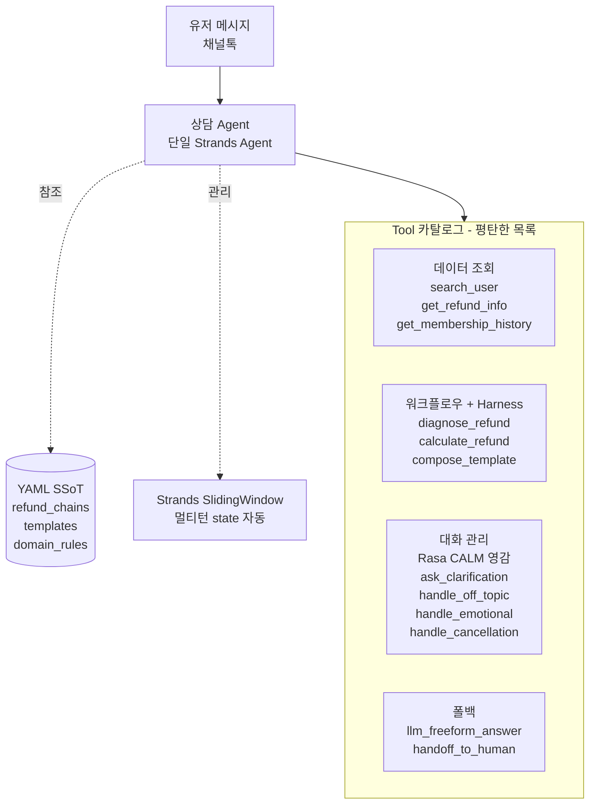

# 2026-04-05 — 채널톡 CS 어시스턴트

## 16:30 — 에이전트 아키텍처 설계 논의 + 단일 에이전트 하이브리드 결정

paymentCycle 재수정 + 골든셋 정리 끝난 다음 단계로 "eval 마이그레이션"에 들어가려다, Gayoon이 "그 전에 에이전트 아키텍처 자체가 아직 설계 안 된 상태"라고 환기시켜줌. 대화 관리 + 템플릿 일관성 + 재질문/감정 대응 공존 구조를 어떻게 짤지 장시간 논의한 끝에 **단일 Strands Agent 하이브리드**로 확정.

**읽은 파일**: `src/refund_agent_v2.py:95-213`, `src/workflow.py:64-163`, `src/templates.py`, `src/llm_fallback.py`, `openspec/demo-plan.md`, `openspec/admin-ui-page-map.md`, `data/test_cases/refund_edge_reclassified.json`

---

### 핵심 고민 (Gayoon 원래 질문)

> "하나의 답변을 위한 워크플로우가 정의돼 있으면, 필요한 정보를 어떻게 요구하는지 알고, 조건 충족 상태에 따라 상담사 대화 패턴대로 끌고 가고, 예기치 못한 케이스에도 재질문/감정 대응을 할 수 있는 구조."

3가지 하위 질문:
1. 템플릿 일관성 + LLM 유연성의 공존
2. 정보 부족 시 에이전트가 스스로 요구
3. 모호/감정/맥락 전환 자연스럽게

---

### 의사결정 경로

**후보 검토 순서**:

1. ❌ Strands Graph (워크플로우 분기 리팩토링용) — 이전 세션에 이미 배제. 데이터 기반 분기라 LLM orchestration 과함
2. 🟡 Rasa CALM Graph 아키텍처 — 대화 관리엔 강하지만 Graph 전체 도입은 오버엔지니어링
3. 🟡 Gayoon 이전 프로젝트의 3-tier 멀티에이전트 (Orchestrator + Executor + Domain) — 복잡 task 용이지만 우리 도메인엔 과함
4. ✅ **단일 Strands Agent 하이브리드** — 구조는 단순, 원칙은 Rasa CALM + Gayoon 이전 프로젝트에서 차용

**최종 선택 이유**:
- 우리 도메인 = API 조회 + 조건 분기 + 답변 생성 (대화 관리 중심)
- 환불 정책 1개 도메인이라 3-tier 복잡도 불필요
- Anthropic "Building effective agents" (2024.12): "Don't build a graph. Start with a simple tool-use loop."
- Scale 필요하면 나중에 3-tier로 진화 가능

---

### 최종 아키텍처 (옵시디언 친화)

**구조 원칙**:
- 에이전트는 **하나** (유저 관점 + 구현 관점 둘 다)
- Tool은 **평탄한 목록** (sub-agent wrapping 없음)
- YAML이 **Single Source of Truth**
- Harness는 **각 tool 내부**에 pre/post validation으로 내장

---

### 차용한 원칙들 (3개 소스)

**소스 1: Gayoon 이전 프로젝트 (YAML/Harness)**
- YAML = SSoT (정책/템플릿/조건 프롬프트 밖으로)
- Turing-incomplete 제한 DSL (`field.path == 'VALUE'`)
- Harness 패턴 (tool 내부 pre/post validation)
- 프롬프트 규칙 15→5개 축소 원칙

**소스 2: Rasa CALM (대화 관리)**
- Command Generator 개념 (LLM이 매 턴 tool 선택)
- Conversation patterns를 tool로 (clarify, chitchat, cancel, correct, emotional)
- Multi-turn state 자동 관리

**소스 3: Anthropic "Building effective agents" (2024.12)**
- Simple tool-loop first
- Graph는 정말 필요할 때만
- Sub-agent는 scale 증명된 후

---

### YAML SSoT의 6가지 강력함 (Gayoon 감탄 포인트)

Gayoon의 `visibility_chain.yaml`을 본 Rocky의 감탄 정리 — 우리 `refund_chains.yaml`도 같은 원칙 적용:

1. **Turing-incomplete DSL** — `field.path == 'VALUE'` 형태만 지원. 안전성 핵심. 규칙이 무한 루프/사이드이펙트 못 냄. LLM이 작성해도 한정된 사고 범위.

2. **Single Source of Truth** — DiagnoseEngine + ActionHarness + KnowledgeHandler가 전부 같은 YAML 참조. 진단/강제/설명의 일관성 자동 보장. **규칙 변경 시 한 파일만 수정**.

3. **Rule ID 재사용 (DRY)** — R8 하나가 5개 체인에서 재활용. 같은 ID로 참조되면서 체인마다 subset만 가져감.

4. **fail_message 템플릿 치환** — 실패 시 `{master.clubPublicType}` 같은 placeholder에 실제 값 끼워넣어 구체적 에러 메시지 생성.

5. **api + api_params 명시** — 각 rule이 필요한 데이터 소스를 선언. 진단 엔진이 자동으로 적절한 admin API 호출. `{master_cms_id}` runtime slot filling.

6. **순서가 체크 순서 = first_failure 반환** — `requires` 배열 순서대로 평가, 첫 실패에서 멈추고 결과 반환. 디버깅 명확.

---

### 핵심 고민 3개 해결 매핑

| 고민 | 해결 메커니즘 |
|---|---|
| ① 상담사 패턴 일관성 | `compose_template` tool이 YAML 템플릿을 **결정론적**으로 렌더링. LLM은 답변을 쓰지 않음 |
| ② 정보 부족 시 요구 | `diagnose_refund` harness가 slot 부족 감지 → LLM이 `ask_clarification` tool 선택 |
| ③ 모호/감정/맥락전환 | LLM이 매 턴 tool 선택 → `handle_off_topic` / `handle_emotional` / `handle_cancellation` / `llm_freeform_answer` 중 |

---

### Rasa CALM Command Generator ≡ Tool-loop (같은 개념, 다른 이름)

| Rasa CALM | 우리 tool-loop |
|---|---|
| LLM이 매 턴 command 생성 | LLM이 매 턴 tool 호출 선택 |
| `StartFlow(refund)` command | `diagnose_refund()` tool call |
| `Clarify(...)` command | `ask_clarification(...)` tool call |
| `Cancel` command | `handle_cancellation()` tool call |
| `Chitchat` command | `handle_off_topic()` tool call |
| Conversation patterns = flows | Conversation patterns = tools |

**→ 이름만 다른 같은 패턴**. Rasa는 graph, 우리는 tool-loop. LLM이 의도 파싱, 코드가 결정론적 실행.

---

### 주요 의사결정 기록

- **단일 에이전트 vs 멀티에이전트**: **단일** 선택. 이유: 환불 정책 1개 도메인, 복잡 사전조건 검증 볼륨 작음, Anthropic/OpenAI/Strands SDK 모두 simple first 권장.
- **Graph vs Tool-loop**: **Tool-loop** 선택. 이유: Gayoon 실증 경험 (LangGraph → Harness 이동), 2024~2025 업계 흐름.
- **Rasa 프레임워크 도입 vs 패턴 차용**: **패턴만 차용**. 이유: Rasa 본체는 인프라 부담, 한국어 적응 필요, 우리 스택(Strands + Bedrock + Streamlit)과 독립 유지.
- **YAML + DSL**: **Gayoon 이전 프로젝트 방식 그대로**. Turing-incomplete, api/params 명시, fail_message 템플릿.
- **Scale 대응**: Phase 6 이후. 환불 외 도메인 추가 시 YAML + tool 추가 → 복잡해지면 3-tier로 진화.

---

### 경계 설정 (범위 밖)

- Gayoon 이전 프로젝트의 3-tier 구조 (Orchestrator + Executor + Domain) — 지금은 차용 안 함. 원칙만 빌림.
- AgentCore Runtime 배포 — 후속
- 해지/기술지원 등 다도메인 구현 — 설계만 염두, 구현은 후속
- Rasa 프레임워크 자체 설치 — ❌

---

### 이 세션에서 Rocky가 배운 것 (자기 정정)

- 이전 세션 메모리 "Strands SDK 배제"는 **부정확한 기억**. 배제한 건 "워크플로우 분기 리팩토링용 Graph"이지 Strands SDK 자체가 아니었음. Gayoon 원래 계획에 Strands 도입이 포함돼 있었고 Rocky가 잘못 기억.
- 레퍼런스 탐색 시 **서브에이전트가 URL/paper/예제를 할루시네이션** 생성할 수 있음. 특히 제품/기관은 실재하지만 구체 URL/파일명은 틀릴 수 있음. **반드시 WebFetch로 직접 검증** 필요.
- **원칙(principle)과 구조(structure) 구분**. 좋은 패턴을 봤을 때 "구조 통째로 베끼기"가 아니라 "원칙만 차용하고 우리 맥락에 번역"이 올바른 접근.
- **"Gayoon 패턴이 최선"이라고 단정하지 말 것**. Gayoon이 "다른 사람들이 해놨을 텐데 왜 레퍼런스 없어?"라고 의심한 게 맞았음. Rasa CALM, Dialogflow CX, LangGraph 등 잘 정립된 프레임워크 다수.

---

### 다음 스텝

1. Plan 파일 재작성 (현재 논의 기반)
2. Phase 0 — Strands SDK + Python 3.10+ venv 준비 + hello-world PoC
3. Phase 1~4 구현
4. 기존 회귀 테스트 유지 (23/23, 389, 8/8)

---
