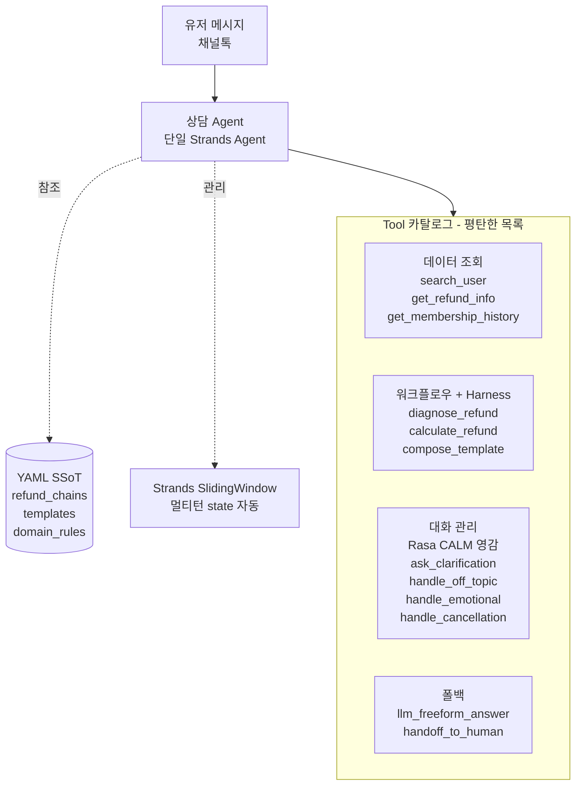

# 2026-04-05 — 채널톡 CS 어시스턴트

## 16:30 — 에이전트 아키텍처 설계 논의 + 단일 에이전트 하이브리드 결정

paymentCycle 재수정 + 골든셋 정리 끝난 다음 단계로 "eval 마이그레이션"에 들어가려다, Gayoon이 "그 전에 에이전트 아키텍처 자체가 아직 설계 안 된 상태"라고 환기시켜줌. 대화 관리 + 템플릿 일관성 + 재질문/감정 대응 공존 구조를 어떻게 짤지 장시간 논의한 끝에 **단일 Strands Agent 하이브리드**로 확정.

**읽은 파일**: `src/refund_agent_v2.py:95-213`, `src/workflow.py:64-163`, `src/templates.py`, `src/llm_fallback.py`, `openspec/demo-plan.md`, `openspec/admin-ui-page-map.md`, `data/test_cases/refund_edge_reclassified.json`

---

### 핵심 고민 (Gayoon 원래 질문)

> "하나의 답변을 위한 워크플로우가 정의돼 있으면, 필요한 정보를 어떻게 요구하는지 알고, 조건 충족 상태에 따라 상담사 대화 패턴대로 끌고 가고, 예기치 못한 케이스에도 재질문/감정 대응을 할 수 있는 구조."

3가지 하위 질문:
1. 템플릿 일관성 + LLM 유연성의 공존
2. 정보 부족 시 에이전트가 스스로 요구
3. 모호/감정/맥락 전환 자연스럽게

---

### 의사결정 경로

**후보 검토 순서**:

1. ❌ Strands Graph (워크플로우 분기 리팩토링용) — 이전 세션에 이미 배제. 데이터 기반 분기라 LLM orchestration 과함
2. 🟡 Rasa CALM Graph 아키텍처 — 대화 관리엔 강하지만 Graph 전체 도입은 오버엔지니어링
3. 🟡 Gayoon 이전 프로젝트의 3-tier 멀티에이전트 (Orchestrator + Executor + Domain) — 복잡 task 용이지만 우리 도메인엔 과함
4. ✅ **단일 Strands Agent 하이브리드** — 구조는 단순, 원칙은 Rasa CALM + Gayoon 이전 프로젝트에서 차용

**최종 선택 이유**:
- 우리 도메인 = API 조회 + 조건 분기 + 답변 생성 (대화 관리 중심)
- 환불 정책 1개 도메인이라 3-tier 복잡도 불필요
- Anthropic "Building effective agents" (2024.12): "Don't build a graph. Start with a simple tool-use loop."
- Scale 필요하면 나중에 3-tier로 진화 가능

---

### 최종 아키텍처 (옵시디언 친화)



**구조 원칙**:
- 에이전트는 **하나** (유저 관점 + 구현 관점 둘 다)
- Tool은 **평탄한 목록** (sub-agent wrapping 없음)
- YAML이 **Single Source of Truth**
- Harness는 **각 tool 내부**에 pre/post validation으로 내장

---

### 차용한 원칙들 (3개 소스)

**소스 1: Gayoon 이전 프로젝트 (YAML/Harness)**
- YAML = SSoT (정책/템플릿/조건 프롬프트 밖으로)
- Turing-incomplete 제한 DSL (`field.path == 'VALUE'`)
- Harness 패턴 (tool 내부 pre/post validation)
- 프롬프트 규칙 15→5개 축소 원칙

**소스 2: Rasa CALM (대화 관리)**
- Command Generator 개념 (LLM이 매 턴 tool 선택)
- Conversation patterns를 tool로 (clarify, chitchat, cancel, correct, emotional)
- Multi-turn state 자동 관리

**소스 3: Anthropic "Building effective agents" (2024.12)**
- Simple tool-loop first
- Graph는 정말 필요할 때만
- Sub-agent는 scale 증명된 후

---

### YAML SSoT의 6가지 강력함 (Gayoon 감탄 포인트)

Gayoon의 `visibility_chain.yaml`을 본 Rocky의 감탄 정리 — 우리 `refund_chains.yaml`도 같은 원칙 적용:

1. **Turing-incomplete DSL** — `field.path == 'VALUE'` 형태만 지원. 안전성 핵심. 규칙이 무한 루프/사이드이펙트 못 냄. LLM이 작성해도 한정된 사고 범위.

2. **Single Source of Truth** — DiagnoseEngine + ActionHarness + KnowledgeHandler가 전부 같은 YAML 참조. 진단/강제/설명의 일관성 자동 보장. **규칙 변경 시 한 파일만 수정**.

3. **Rule ID 재사용 (DRY)** — R8 하나가 5개 체인에서 재활용. 같은 ID로 참조되면서 체인마다 subset만 가져감.

4. **fail_message 템플릿 치환** — 실패 시 `{master.clubPublicType}` 같은 placeholder에 실제 값 끼워넣어 구체적 에러 메시지 생성.

5. **api + api_params 명시** — 각 rule이 필요한 데이터 소스를 선언. 진단 엔진이 자동으로 적절한 admin API 호출. `{master_cms_id}` runtime slot filling.

6. **순서가 체크 순서 = first_failure 반환** — `requires` 배열 순서대로 평가, 첫 실패에서 멈추고 결과 반환. 디버깅 명확.

---

### 핵심 고민 3개 해결 매핑

| 고민 | 해결 메커니즘 |
|---|---|
| ① 상담사 패턴 일관성 | `compose_template` tool이 YAML 템플릿을 **결정론적**으로 렌더링. LLM은 답변을 쓰지 않음 |
| ② 정보 부족 시 요구 | `diagnose_refund` harness가 slot 부족 감지 → LLM이 `ask_clarification` tool 선택 |
| ③ 모호/감정/맥락전환 | LLM이 매 턴 tool 선택 → `handle_off_topic` / `handle_emotional` / `handle_cancellation` / `llm_freeform_answer` 중 |

---

### Rasa CALM Command Generator ≡ Tool-loop (같은 개념, 다른 이름)

| Rasa CALM | 우리 tool-loop |
|---|---|
| LLM이 매 턴 command 생성 | LLM이 매 턴 tool 호출 선택 |
| `StartFlow(refund)` command | `diagnose_refund()` tool call |
| `Clarify(...)` command | `ask_clarification(...)` tool call |
| `Cancel` command | `handle_cancellation()` tool call |
| `Chitchat` command | `handle_off_topic()` tool call |
| Conversation patterns = flows | Conversation patterns = tools |

**→ 이름만 다른 같은 패턴**. Rasa는 graph, 우리는 tool-loop. LLM이 의도 파싱, 코드가 결정론적 실행.

---

### 주요 의사결정 기록

- **단일 에이전트 vs 멀티에이전트**: **단일** 선택. 이유: 환불 정책 1개 도메인, 복잡 사전조건 검증 볼륨 작음, Anthropic/OpenAI/Strands SDK 모두 simple first 권장.
- **Graph vs Tool-loop**: **Tool-loop** 선택. 이유: Gayoon 실증 경험 (LangGraph → Harness 이동), 2024~2025 업계 흐름.
- **Rasa 프레임워크 도입 vs 패턴 차용**: **패턴만 차용**. 이유: Rasa 본체는 인프라 부담, 한국어 적응 필요, 우리 스택(Strands + Bedrock + Streamlit)과 독립 유지.
- **YAML + DSL**: **Gayoon 이전 프로젝트 방식 그대로**. Turing-incomplete, api/params 명시, fail_message 템플릿.
- **Scale 대응**: Phase 6 이후. 환불 외 도메인 추가 시 YAML + tool 추가 → 복잡해지면 3-tier로 진화.

---

### 경계 설정 (범위 밖)

- Gayoon 이전 프로젝트의 3-tier 구조 (Orchestrator + Executor + Domain) — 지금은 차용 안 함. 원칙만 빌림.
- AgentCore Runtime 배포 — 후속
- 해지/기술지원 등 다도메인 구현 — 설계만 염두, 구현은 후속
- Rasa 프레임워크 자체 설치 — ❌

---

### 이 세션에서 Rocky가 배운 것 (자기 정정)

- 이전 세션 메모리 "Strands SDK 배제"는 **부정확한 기억**. 배제한 건 "워크플로우 분기 리팩토링용 Graph"이지 Strands SDK 자체가 아니었음. Gayoon 원래 계획에 Strands 도입이 포함돼 있었고 Rocky가 잘못 기억.
- 레퍼런스 탐색 시 **서브에이전트가 URL/paper/예제를 할루시네이션** 생성할 수 있음. 특히 제품/기관은 실재하지만 구체 URL/파일명은 틀릴 수 있음. **반드시 WebFetch로 직접 검증** 필요.
- **원칙(principle)과 구조(structure) 구분**. 좋은 패턴을 봤을 때 "구조 통째로 베끼기"가 아니라 "원칙만 차용하고 우리 맥락에 번역"이 올바른 접근.
- **"Gayoon 패턴이 최선"이라고 단정하지 말 것**. Gayoon이 "다른 사람들이 해놨을 텐데 왜 레퍼런스 없어?"라고 의심한 게 맞았음. Rasa CALM, Dialogflow CX, LangGraph 등 잘 정립된 프레임워크 다수.

---

### 다음 스텝

1. Plan 파일 재작성 (현재 논의 기반)
2. Phase 0 — Strands SDK + Python 3.10+ venv 준비 + hello-world PoC
3. Phase 1~4 구현
4. 기존 회귀 테스트 유지 (23/23, 389, 8/8)

---

## 17:30 — Phase 5-A edge 라우팅 + Phase 5-B 평가 체계 플랜 (골든셋 tautology 해소가 핵심)

Phase 0~4 완료 후 두 가지 작업: (1) edge 4% 대응 라우팅 체인 추가(Phase 5-A, 커밋 `ba0853f`), (2) 평가 체계(Phase 5-B) 플랜 수립. **이 세션의 가장 중요한 지적 사건**은 Phase 5-B 설계 중 Rocky가 "정책 = 구현 = tautology" 오버씽킹을 했고 Gayoon이 한 문장으로 교정해준 것.

**읽은 파일**: `data/test_cases/refund_cases_by_type_3months.json` (3개월 3,110건 분류), `data/test_cases/refund_convos_{jan,feb,mar}_full.json` (raw turns), `data/test_cases/classified_3months.json:1`, `data/test_cases/refund_edge_reclassified.json` (edge 48건), `openspec/refund-agent-flow.md` (v1 분석), `openspec/refund-agent-flow-v2.md` (v2 아키텍처), `openspec/data-exploration-results.md:62-77` (환불 공식 EP-001~005), `.claude/notes/채널톡 어시스턴트/2026-04-02.md` (15:30 정책 결정), `.claude/notes/채널톡 어시스턴트/2026-04-04.md` (18:30 edge 5패턴)

---

### Phase 5-A — edge 라우팅 5개 체인 (요약)

3개월 전체 **3,110건 중 edge는 122건(4%)**뿐. v1에서 본 "T99 61%"는 340건 매니저 샘플 기준이었고 실제 전체 비율은 훨씬 작음. **RAG 구현 불필요**.

2026-04-04 노트 18:30의 5패턴을 `refund_chains.yaml` 체인 5개로 1:1 매핑:

| 패턴 | chain_id | 종착지 |
|---|---|---|
| 시스템 오류 | `is_system_error` | `T_LLM_FALLBACK` → `handoff_to_human` |
| 복합 이슈 | `is_compound_issue` | `T_LLM_FALLBACK` → `handoff_to_human` |
| 감정 폭발 | `is_emotional_escalation` | `T_LLM_FALLBACK` + `handle_emotional_distress` opener |
| 철회 | `is_flow_cancellation` | `T_LLM_FALLBACK` → `handle_cancellation_of_flow` |
| 예외환불 | `is_exception_refund_request` | `T_LLM_FALLBACK` (매니저 재량) |

**새 텍스트 템플릿 0개, 새 tool 0개**. 기존 리소스 재사용만. keyword_groups 5개 (104 키워드) 추가.

**수치**: smoke test 12/12 통과 (5패턴 × 2~3건 + 카드 회귀 1건), 회귀 pytest 3 passed + eval_golden 8/8.

---

### Phase 5-B 설계 중 Rocky의 오버씽킹 (← 이 노트의 핵심)

**Rocky가 처음 제안한 것 (잘못된 방향)**:
- "eval_elements 기반 rubric 파이프라인 직접 구현"
- 그 다음엔 "Gayoon이 30건 수동 큐레이션해야 독립성 확보"
- 이유: "정책(`refund_chains.yaml`) = 구현 그 자체라 구현을 구현으로 평가하는 tautology가 됨"

**Gayoon 교정 (한 문장)**:
> "근데 그 골든셋이 사실 기존 실제 상담사 답변이 되는 거야. (...) 기존에 매뉴얼이나 기준이 없어서 상담사마다 같은 유형에 다르게 답변하는거야. 그렇지만 다 비슷하게 맞는 것들일거거든. 그러니 우리는 그 중 하나를 확정해서 대응하게 하면 되는 거고 (...) 우리가 분류해둔 데이터들을 참고해서 골든셋을 만들면 되는 거지."

**교정 후 Rocky가 이해한 구조**:

```
정책 (사람이 외부에서 결정)
   │  2026-04-02 15:30 노트에 이미 Gayoon이 확정:
   │    - 미환불 있으면 항상 T2
   │    - 전부 환불됨 → T3
   │    - 결제 없음 → T1
   │    - T4 리텐션 빼기 (매니저 재량)
   │    - 이전 턴 T2 → T3
   ▼
매니저 실답변 (비일관 92%지만 "다 비슷하게 맞는 것들")
   │
   │  ┌──────────────┐         ┌──────────────┐
   └──▶ 골든셋(추출)  │         │   구현       │
       │ 정책에 맞는  │         │ refund_chains│
       │ 답변 확정    │         │    .yaml     │
       └──────┬───────┘         └──────┬───────┘
              │                        │
              └────────┬───────────────┘
                       ▼
                 구현이 골든셋 통과하는지 평가
                 (독립 ground truth ✓)
```

**왜 tautology 아닌가**:
- 정책의 **출처**는 사람(Gayoon)의 외부 결정이지 코드가 아님
- 골든셋의 **출처**는 **실데이터(매니저 답변)**에서 **정책에 맞는 것**을 추출
- 구현은 그 정책을 YAML로 옮긴 것 — 정책을 **따라야 하는** 대상
- 즉 "정책 → 골든셋" 경로와 "정책 → 구현" 경로가 **병행**. 서로 참조 안 함
- 평가는 구현이 정책을 얼마나 정확히 반영하는지 골든셋으로 채점하는 것
- **tautology는 "구현이 정책을 정의하고 정책이 구현을 평가"일 때 성립하는데, 여기선 정책이 상위이고 구현/골든셋은 각자 정책 따라감**

---

### 골든셋 자동 조합 방법 (Phase 5-B-0의 핵심 스크립트)

기존 데이터가 이미 있어서 **새로 만드는 게 아니라 조인만 하면 됨**. 재료:

| 파일 | 포함된 것 | 역할 |
|---|---|---|
| `data/test_cases/refund_cases_by_type_3months.json` | 3,110건 유형 분류 (T1 516, T2 1002, T3 963, T6 108, T8 8, edge 122, error 384) | **유형별 chat_id 샘플링 풀** |
| `data/test_cases/refund_convos_{jan,feb,mar}_full.json` | 월별 raw 대화, 각 건에 `chat_id` + `turns` (user + **manager 답변 포함**) | **매니저 답변 원문 소스** |
| `data/test_cases/classified_3months.json` | 882건, chat_id + user message + type + `sufficient` + `missing` | 정보 충분성 필터 |
| `data/test_cases/refund_test_cases_enriched.json` | 343건 admin API enriched (결제/열람/환불 이력 복원) | **당시 시점 상태 복원** → amount_accuracy 계산용 |
| `data/test_cases/refund_edge_reclassified.json` | edge 48건 (A_워크플로우 38 + B_LLM 10) + `eval_elements` rubric | **edge AgentCore LLM judge 재료** |

**조합 파이프라인** (`scripts/build_eval_golden.py` 다음 세션 작성 예정):

```
1. refund_cases_by_type_3months.json에서 유형별 샘플링
     T1 × 5 + T2 × 10 + T3 × 5 + T6 × 3 + T8 × 2 = 25건 (normal)
     + edge B_LLM 10건 = 35건 후보

2. 각 chat_id로 refund_convos_{jan,feb,mar}_full.json 조인
     → user turns + manager turns 추출

3. 각 후보에 자동 필드 채움:
     - chat_id, type (분류 태그)
     - user_messages (원본)
     - manager_messages (정답 후보)
     - expected_template_id (type → template 자동 매핑)
     - expected_tools (type → 필수 tool 매트릭스, eval-criteria.md)
     - expected_amount (T2/T3만, enriched 데이터 + EP-001~005 공식 적용)

4. candidates.json 저장 (검수 대기)

5. Gayoon 수동 검수 (30분~2시간)
     - 매니저 답변이 정책 부합 → approved: true
     - 부합 안 함 → 폐기
     - 변수값 확정

6. approved.json → 30건 내외 최종 골든셋
```

**Gayoon 큐레이션 부담 = 검수만 (자유 작성 아님)**. Rocky가 아까 "큐레이션 부담 커서 tautology 피하려면 Gayoon이 처음부터 만들어야"라고 한 건 오버 요구였음.

---

### Phase 5-B 단계 (플랜 파일 `.claude/plans/floofy-drifting-hollerith.md` 내)

| 단계 | 내용 | 레퍼런스 |
|---|---|---|
| **5-B-0** | 골든셋 추출 + `eval-criteria.md` + Gayoon 검수 | **사전작업, 이게 뼈대** |
| 5-B-1 | strands-agents-evals setup + type_accuracy + amount_accuracy | `~/Documents/ai/us-product-agent/eval_scenarios.py:46-52, 239-261, 383-445, 751-754` |
| 5-B-2 | AgentCore Evaluation + query_completeness | `eval_scenarios.py:554-656`, `scripts/eval_poc.py` (M1 POC) |
| 5-B-3 | pii_compliance (regex) + edge B_LLM 10건 LLM judge | `eval_elements`를 custom rubric으로 |
| 5-B-4 | 통합 entry point `run_evals.py` + 대시보드 + `eval_golden.py` 제거 | |

**프레임워크 리스크 해소**: 원래 Rocky는 "Phase 0 같은 사전 PoC 2시간 투자 필요"라고 했지만 Gayoon이 "`us-product-agent` 디렉토리 이미 써봤으니 막히면 참고"라고 답해 **PoC 단계 스킵**.

---

### 4개 평가자별 ground truth 출처 (정리)

| 평가자 | 출처 | 상태 |
|---|---|---|
| **type_accuracy** | 확정 정책 매트릭스 (2026-04-02 15:30 노트) + 골든셋 approved.json | 재료 있음 |
| **amount_accuracy** | `data-exploration-results.md:62-77` EP-001~005 공식 + enriched 데이터로 계산 | 재료 있음 |
| **query_completeness** | `eval-criteria.md`에 **신규 정의** (T2 → get_transaction + calculate_refund 필수 등) | **기준 없음 — 신규 작성 필요** (5-B-0에서) |
| **pii_compliance** | 정규식 목록 (카드번호/전화/이메일/주민번호) | 쉬움 |

---

### 이 세션에서 Rocky가 배운 것 (자기 정정 #2)

- **"정책 = 구현 = tautology" 오버씽킹 금지**. 정책 출처는 사람이지 코드가 아님. 골든셋은 실데이터에서 추출하는 거지 수동 작성이 아님.
- **Gayoon이 이전 세션에서 이미 결정한 것을 기억해낼 것**. 2026-04-02 15:30 "정책 결정"과 16:00 "확정 플로우"가 이미 있는데 Rocky가 "새로 정의해야 함"이라고 제안했던 건 과거 결정을 놓친 것. 노트/openspec 먼저 읽는 게 평가 설계의 선행 단계.
- **평가 설계 시 "기준이 뭐냐"를 먼저 물어보기**. 프레임워크(strands-evals/AgentCore) 얘기는 그 다음. Gayoon의 "지금 구현한게 맞는지, 테스트 쓰려는 맞다는 기준이 뭔지 알아야하는거 아니야?" 한마디가 이 순서를 바로잡음.
- **레퍼런스 프로젝트가 있으면 PoC 스킵 가능**. `us-product-agent`가 있어서 Phase 5-B 앞에 PoC 단계 불필요. 조기에 "레퍼런스 있음?" 물어봤으면 Rocky가 혼자 PoC 시간 제안 안 했을 것.

---

### 오늘 세션 커밋 3개

| Hash | 내용 |
|---|---|
| `6612c85` | Phase 0~4 Strands 단일 에이전트 하이브리드 기반 인프라 |
| `290ee9f` | Phase 4.5 — openspec/refund-agent-flow-v2.md 설계 문서 |
| `ba0853f` | Phase 5-A — edge 라우팅 체인 5개 |

**다음 세션 진입점**: `.claude/plans/floofy-drifting-hollerith.md` Phase 5-B 섹션 → 5-B-0-1부터 시작 (`scripts/build_eval_golden.py` 작성).

---
